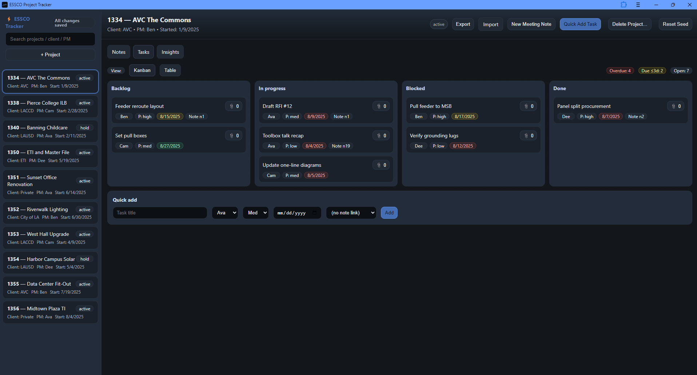

# ESSCO Project Tracker

A fast, offline-first project tracker for engineering, construction, and consulting teams.  
Track projects, meeting notes, and tasks without a server — everything stays in your browser.  

 <!-- Replace with real screenshot -->

---

## Features at a Glance
- **Projects** — Create, archive, and delete with job numbers, client, PM, and status.
- **Notes** — Meeting notes linked to tasks, with dates and decisions.
- **Tasks** — Kanban or table view, priorities, due dates, assignees, and note links.
- **Insights** — Visual workload, due/overdue counts, and meeting coverage.
- **Offline-First** — Works with no internet; all data stored locally.
- **Import/Export** — Backup or migrate your data as JSON.
- **Installable** — Progressive Web App for desktop-like experience.
- **Private** — No login, no tracking, no server.

---

## Getting Started

### 1. Clone or Download
```bash
git clone https://github.com/bpopineau/essco-tracker.git
cd essco-tracker
```
Or download as ZIP from GitHub and unzip.

### 2. Open in Browser
Open `index.html` in Chrome or Edge.  
For GitHub Pages deployment: push to `main` and enable Pages — the app will run entirely from there.

### 3. (Optional) Install as App
Click the install icon in Chrome/Edge to add to your desktop.

---

## User Guide

### Sidebar
- Search/filter projects by name, client, PM, or job number.
- Add projects with the **+ Project** button.
- Click a project to open its details.

### Header
- Displays project metadata and status.
- Quick actions: export/import, add note/task, archive/delete project.

### Tabs
- **Notes** — Meeting notes per project, linkable to tasks.
- **Tasks** — Kanban drag-and-drop or sortable table.
- **Insights** — Charts for workload, due dates, and meeting coverage.

### Import / Export
- **Export** — Download all data as JSON.
- **Import** — Merge or restore from a JSON backup.

---

## Developer Guide

### Architecture
- **Frontend-only** — 100% client-side, plain ES modules.
- **State** — Observable store (src/store.js).
- **Persistence** — localStorage for structured data; IndexedDB for attachments.
- **Views** — Modular UI in src/views/ (header, sidebar, notes, tasks, insights).
- **PWA** — Service worker + manifest for offline and installability.

### Data Model
```js
{
  users: [ { id, name, email } ],
  projects: [ { id, job_number, name, client, status, pm_user_id, start_date } ],
  notes: [ { id, project_id, meeting_date, body } ],
  tasks: [ { id, project_id, note_id, title, assignee_user_id, status, priority, due_date, attachments } ],
  ui: { selectedProjectId, activeTab, viewMode, ... }
}
```
### File Structure (high-level)
- index.html — Main entry point
- styles.css — Global styles
- sw.js / manifest.json — PWA support
- src/ — All JavaScript source  
  - main.js — App bootstrap  
  - schema.js — Initial data  
  - storage.js — Save/load/import/export  
  - store.js — State management  
  - views/ — UI modules  

---

## Offline & Privacy
- All data is local; nothing is sent to a server.
- Works fully offline after first load.
- No analytics or tracking.
- Clear data anytime via browser storage settings or the "Reset Seed" dev button.

---

## Troubleshooting
- **Data not saving?** Enable localStorage/IndexedDB in your browser.
- **App not updating?** Hard refresh (Ctrl+Shift+R) or clear cache.
- **Attachments not working?** Use Chrome/Edge with File System Access API.

---

## Contributing
1. Fork and create a branch.
2. Make changes with clear commit messages.
3. Test in Chrome/Edge; optionally Firefox/Safari.
4. Submit a pull request.

---

## License
MIT — see LICENSE.

---

*Built for teams who want a fast, portable tracker without cloud dependencies.*
